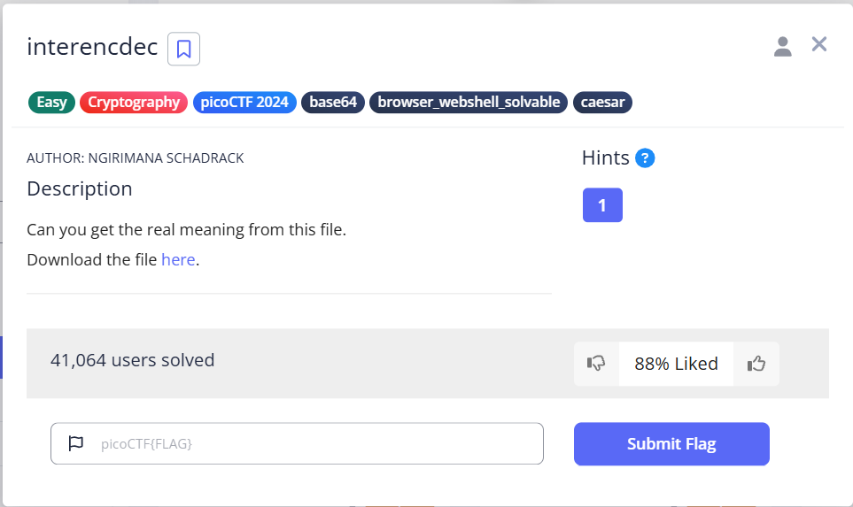
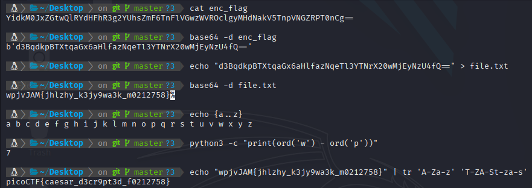

# interencdec - Writeup

## Description



## solving process


### Solution

For this task we are given a base 64 string we gonna use base64 tool to decode it and then we will get another base 64 string wrapped up with b' ' we will decode it again and we will got a cisaer ciphertext with each char is mapped foreward 7 times ( p -> w )

we will use the tr command to decode it and got the flag.



### solver

```python
#!/usr/bin/env python3
import base64

enc_flag = "YidkM0JxZGtwQlRYdHFhR3g2YUhsZmF6TnFlVGwzWVROclgyMHdNakV5TnpVNGZRPT0nCg=="
print(enc_flag)
decoded_bytes = base64.b64decode(enc_flag)
decoded_text = decoded_bytes.decode("utf-8")
print(decoded_text[2:-2])


decoded_bytes = base64.b64decode(decoded_text[2:-2])
decoded_text = decoded_bytes.decode("utf-8")
print(decoded_text)

def caesar_decrypt(ciphertext, shift):
    result = ""
    for char in ciphertext:
        if char.isalpha():
            base = ord('A') if char.isupper() else ord('a')
            result += chr((ord(char) - base - shift) % 26 + base)
        else:
            result += char
    return result

ciphertext = decoded_text
shift = 7

plaintext = caesar_decrypt(ciphertext, shift)
print(plaintext)

```

### flag

```
picoCTF{caesar_d3cr9pt3d_f0212758}
```
