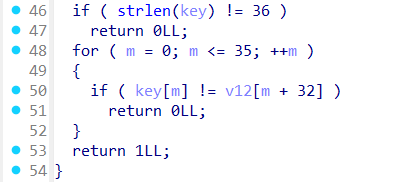
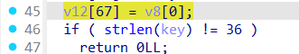

# Keygenme - Writeup

## Description


## solving process


## solution

In this challenge we have a binary named Keygenme that takes a license key from user input which is the flag and check if it valid or not .


in `sub_1209` the program takes the first part of the flag `picoCTF{br1ng*y0ur_0wn_k3y_` and run some obfuscation to add more 8 characters


so the final flag format we be `picoCTF{br1ng_y0ur_0wn_k3y_12345678}` in which we should get the final 8 bytes and wrap it with `}` ,, and finally the program compare the original key with our input which should be 36 character length



so to solve this we need make some dynamic analysis ,, for that we should input a dummy 36 char string and make a breakpoint exactly at this line (line 45) and see what the program is comparing our input with which is the flag .



## solver

i used gdb's python api to solve this task :

```python
#!/usr/bin/env python3
import gdb
import re

# Load the binary
gdb.execute("file ./keygenme")

# Set a breakpoint at the address of printf (or the symbol if available)
gdb.execute("b *printf")

# Run the binary
# dummy_flag.txt : "picoCTF{br1ng_y0ur_0wn_k3y_????????}"
gdb.execute("run < dummy_flag.txt")

# Step out of the current function after hitting the breakpoint
gdb.execute("finish")

gdb.execute("b* 0x55555555540a")

gdb.execute("c")

flag = gdb.execute("x/s 0x7fffffffdaf0", to_string=True)

print(flag)


match = re.search(r'picoCTF\{.*?\}', flag)
if match:
    flag = match.group(0)
    print(f"FLAG : {flag}")
else:
    print("Flag not found.")
gdb.execute("quit")
```

## flag

```
picoCTF{br1ng_y0ur_0wn_k3y_19836cd8}
```
