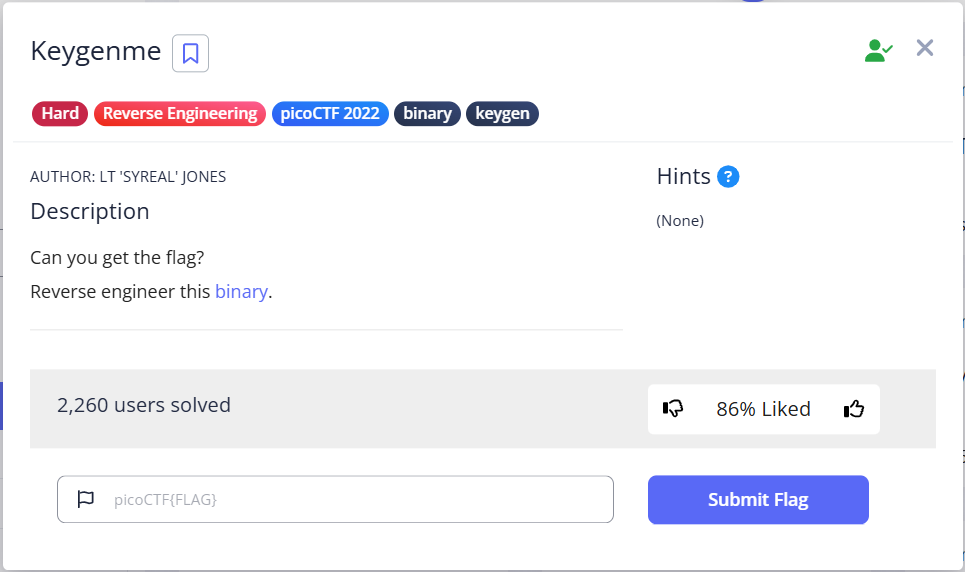
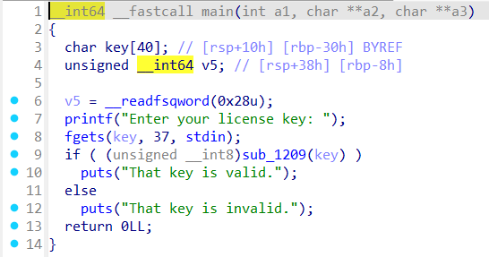
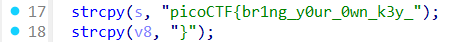

# Keygenme - Writeup

## Description



## solving process


## solution

In this challenge we have a binary named Keygenme that takes a license key from user input which is the flag and check if it valid or not .



in `sub_1209` the program takes the first part of the flag `picoCTF{br1ng*y0ur_0wn_k3y_` and run some obfuscation to add more 8 characters
so the final flag format we be `picoCTF{br1ng_y0ur_0wn_k3y_12345678}` ,, and finally the program compare the original key with our input which should be 36 character length ,, so to solve this we need to input a dummy 36 char string and make a breakpoint exactly at this line (line 45) and see what the program is comparing our input with which is the flag .



## solver

## flag

```
picoCTF{br1ng_y0ur_0wn_k3y_19836cd8}
```
