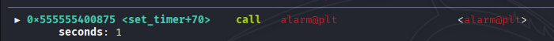
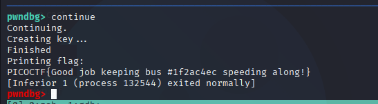

# Need For Speed - Writeup

## Description


## solving process


## solution

in this task we have binary file named need-for-speed that has print_flag function that print the flag ,, but we have a function set_timer that is called before the print_flag function and close the program using alarm signal before the execution of print_flag function ,, so to solve this task we can use gdb to increase the rdi value exactly before the execution of the call alarm@plt instruction .




Now if we hit continue we should see our flag.



## solver

u can execute this gdb script to get the flag ,, use this command

```bash
gdb -x solver.gdb ./need-for-speed
```

```gdb
main
b* set_timer+70
c
set $rdi=50
c
```

## flag

```
PICOCTF{Good job keeping bus #1f2ac4ec speeding along!}
```
