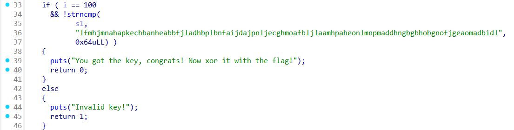

# OTP Implementation - Writeup

## Description


## Solution

In this challenge we have a binary that takes a key as input and verify if that key is correct or not ,, for this the binary was doing some jumbling with our input key then he compares it with a 100 byte string



to solve this will reverse the jumbling to get the correct key and xor it with the string in flag.txt to get the flag
also we will solve it using gdb's Python API .

## Solver

### Solver 1 : Reversing the process

```python
s1_final = "lfmhjmnahapkechbanheabbfjladhbplbnfaijdajpnljecghmoafbljlaamhpaheonlmnpmaddhngbgbhobgnofjgeaomadbidl"

# Reverse the "+97" step:
s1_original = [ord(c) - 97 for c in s1_final]

HEX_CHARS = [ord(c) for c in '0123456789abcdef']

def jumble(a1: int) -> int:
    v2 = a1
    if a1 > 96:
        v2 = a1 + 9
    v3 = 2 * (v2 % 16)
    if v3 > 15:
        v3 += 1
    return v3 & 0xFF

def reverse_jumble_search(target_value, s1_prev):
    for ch in HEX_CHARS:
        j = jumble(ch)
        test = (s1_prev + j) & 0xF
        if test == target_value:
            return ch
    return None

def recover_dest(s1_list):
    dest = []

    # Step 1: Recover dest[0]
    for ch in HEX_CHARS:
        if jumble(ch) % 16 == s1_list[0]:
            dest.append(ch)
            break

    # Step 2: Recover rest
    for i in range(1, len(s1_list)):
        ch = reverse_jumble_search(s1_list[i], s1_list[i - 1])
        if ch is None:
            print(f"Failed at position {i}")
            break
        dest.append(ch)

    return bytes(dest).decode('ascii')

print(f"KEY FOUND : {recover_dest(s1_original)}")

def xor_hex_to_string(hex1: str, hex2: str) -> str:
    bytes1 = bytes.fromhex(hex1)
    bytes2 = bytes.fromhex(hex2)

    if len(bytes1) != len(bytes2):
        raise ValueError("Input strings must have the same length.")

    result_bytes = bytes(a ^ b for a, b in zip(bytes1, bytes2))

    try:
        result_string = result_bytes.decode('utf-8')
    except UnicodeDecodeError:
        result_string = result_bytes.decode('latin-1')  # fallback for non-UTF-8 printable data

    return result_string

# Example usage:
hex1 = "d5bd1989bcfd57a5fe5e680221a92576364d485ec3777d728a11a6571a06d48be5f7881e29023cdad3b9ab8b2e7677297bd4"
hex2 = "a5d47ae6ffa911de9d2b1b7611c47a1c43202a32f0042246f822c82345328becd5b8ec4118660f9b8cdc98bd1a41141943a9"

flag = xor_hex_to_string(hex1, hex2)
print(f"FLAG : {flag}")
```

### Sovler 2 : Using gdb's Python API

```python

#!/usr/bin/env python3
import gdb

gdb.execute('file ./otp')
gdb.execute('bp 0x0000555555400630') # breakpoint at strncmp@plt

hexa = list('0123456789abcdef')
guess = ''
cmp = 'lfmhjmnahapkechbanheabbfjladhbplbnfaijdajpnljecghmoafbljlaamhpaheonlmnpmaddhngbgbhobgnofjgeaomadbidl'
i = 0

while i != 100:
    found = False
    for val in hexa:
        gdb.execute('run ' + guess + (val * (100 - i)))
        run = gdb.execute('x/s 0x7fffffffdad0', to_string=True) # our input
        run = run[17:117]
        if cmp[i] == run[i]:
            found = True
            guess += val
            break
    i += 1
    if not found:
        guess += '0'
    print(guess)
print(guess)

```

## flag

```
picoCTF{cust0m_jumbl3s_4r3nt_4_g0Od_1d3A_e3647c08}
```
