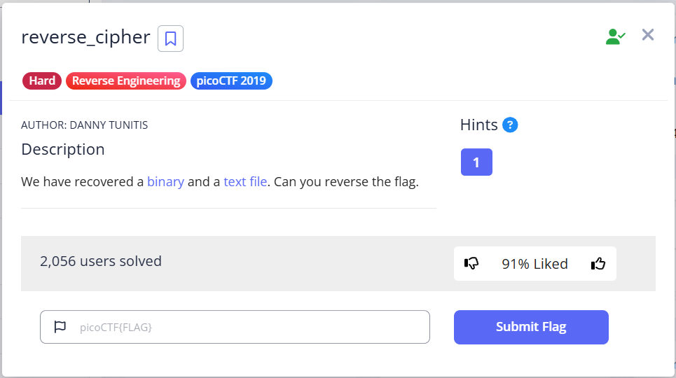
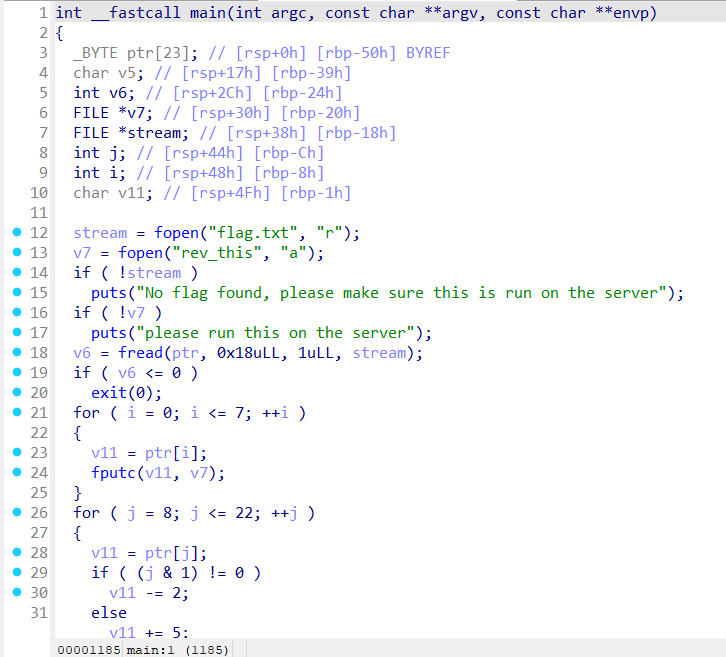
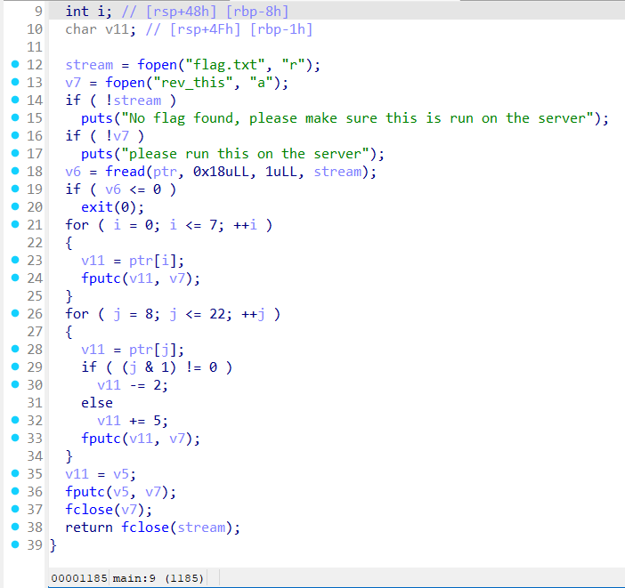

# reverse_cipher - Writeup

## Description



## solving process


## Solution

In this challenge we have binary named rev that takes the chars of the flag indexed between 8 - 23 and making some jumbling to change this and store the result in a file named rev_this ,, to solve this challenge we simply need to reverse the jumbling to get the original flag.





## Solver

```python
#!/usr/bin/env python3

def reverse_rev(obf: str) -> str:
    """
    Reverse the transformation applied in the C rev task.
    - indices 0–7: unchanged
    - indices 8–22:
        odd  indices: char was decremented by 2 → add 2
        even indices: char was incremented by 5 → subtract 5
    - beyond index 22: unchanged
    """
    decoded = []
    for i, c in enumerate(obf):
        if 0 <= i <= 7:
            decoded.append(c)
        elif 8 <= i <= 22:
            if i % 2 == 1:      # odd index
                decoded.append(chr(ord(c) + 2))
            else:               # even index
                decoded.append(chr(ord(c) - 5))
        else:
            decoded.append(c)
    return "".join(decoded)


def main():
    # The obfuscated output from rev_this
    obfuscated = "picoCTF{w1{1wq8/7376j.:}"
    flag = reverse_rev(obfuscated)
    print(flag)


if __name__ == "__main__":
    main()

```

## flag

```
picoCTF{r3v3rs312528e05}
```
