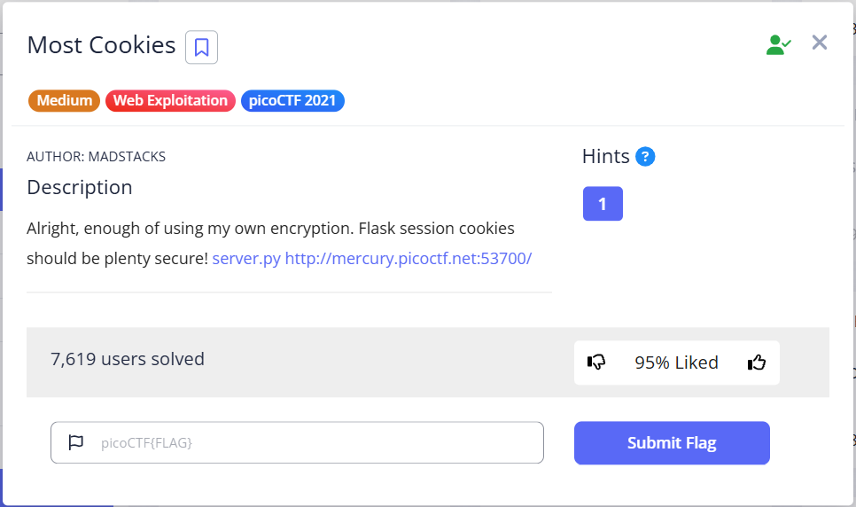
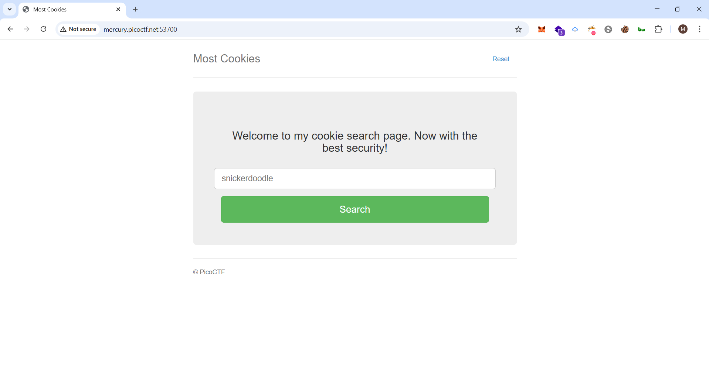
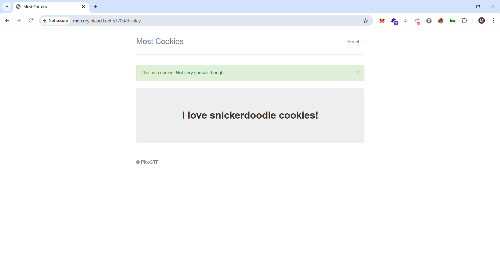
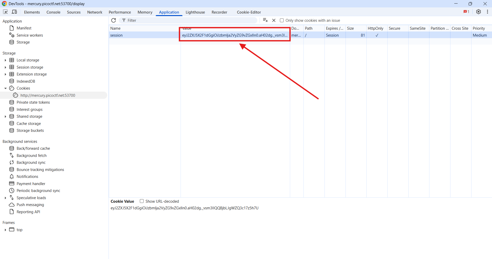

# Most Cookies - Writeup

## Description

## Solution

We have a websit that apparently taking input from user

to authentication you should enter a valid cookie name ,, i tried snickerdoodle

And now we can see that we have a session cookie after inspection the website.

