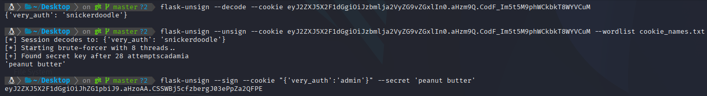
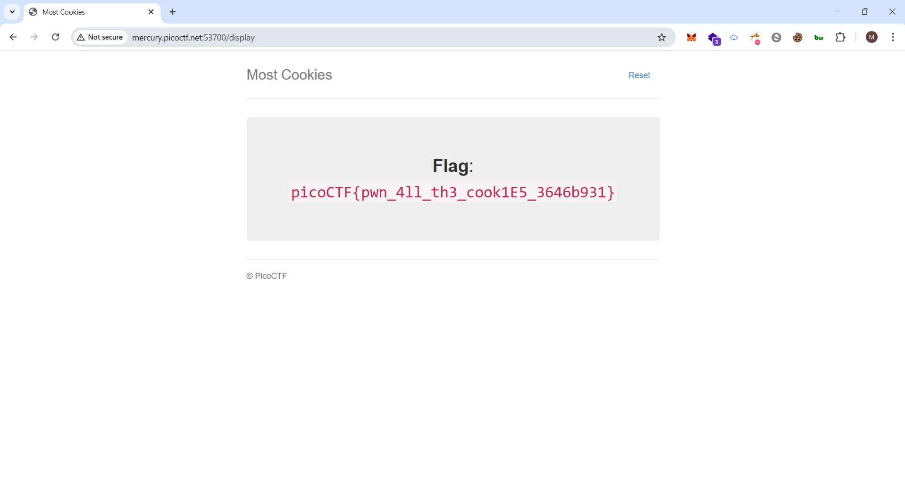

# Most Cookies - Writeup

## Description


## Solution

We have a websit that apparently taking input from user


to authentication you should enter a valid cookie name ,, i tried snickerdoodle


And now we can see that we have a session cookie after inspection the website.


i decoded the cookie using `flask-unsign` tool and it shows `{'very_auth':'snickerdoodle'}`


So now i went reviewing the flask code provided by the challenge and i noticed two things ,, the first thing is this route that checks if `session["very_auth"]` == `admin` and if true if routes flag.html


The second thing i noticed is that the flask code is signing the cookie with random secret_key from a list ,, so basically we can crack this session using `flask-unsign` because we can guess the secret_key .


So now i tried to crack the cookie session using `flask-unsign` and i successfully found the secret_key which is `peanut butter`
and i made a cookie `{'very_auth':'admin'}` and i signed with the secret key.



the last thing i did was sending a request with the admin cookie and i got the flag.



## flag

```
picoCTF{pwn_4ll_th3_cook1E5_3646b931}
```
