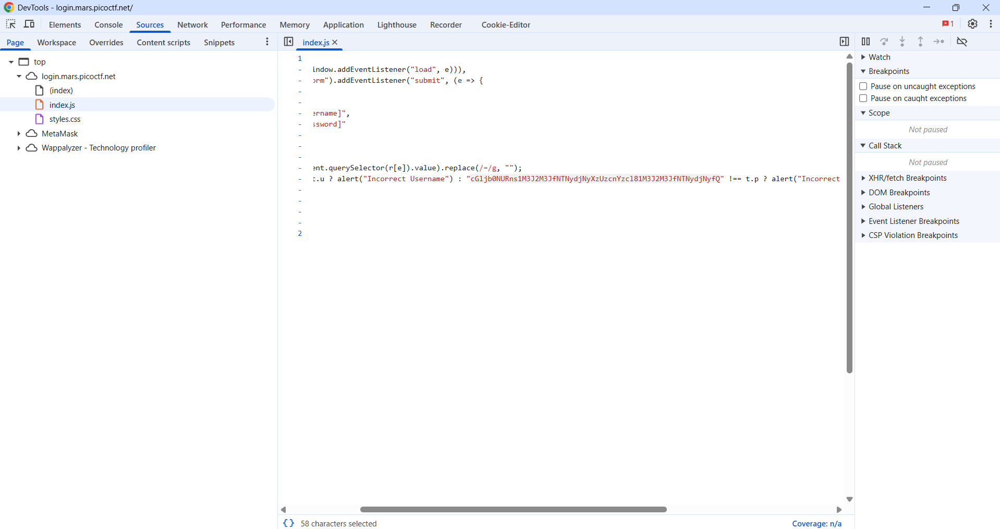

# login - Writeup

## Description


## Solution

for this challenge we got a login page


first thing i tried to do is inspecting the website ,, and i found a string in index.js that looks like a bas64 string



i tried to decode in cyberchef and i got the flag.


## flag

```
picoCTF{53rv3r_53rv3r_53rv3r_53rv3r_53rv3r}
```
